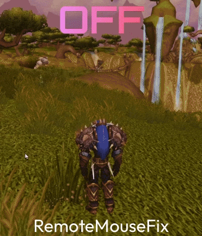
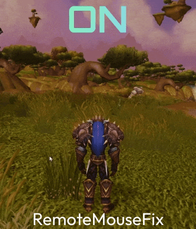

# RemoteMouseFix

[](https://github.com/quasistatic-setup/RemoteMouseFix/actions/workflows/build.yml)

RemoteMouseFix is a portable Windows tool for mouse and camera jumps in 3D games used
through remote-control software. It was created for **TeamViewer and World of Warcraft
3.3.5a**, where a click into the 3D view can make the camera jump and remote camera turns
are difficult to control.

The tool runs beside the game. It does not modify or inject code into the game, install a
driver, require administrator rights, access the network, or write to the registry.

> [!IMPORTANT]
> RemoteMouseFix is experimental. The correction has been developed from measurements of
> TeamViewer with WoW 3.3.5a. Other games and remote-control applications may behave
> differently.

## What the correction changes

Both recordings show the same camera turn in WoW 3.3.5a through TeamViewer: the right
mouse button is held while the pointer moves slowly left and right.

| Correction `off` | Correction `absolute` |
| --- | --- |
|  |  |
| The injected absolute pointer overwrites the game's cursor warp, so the camera jumps and overshoots. | The warp stays intact and the remote pointer movement reaches the game as a smooth turn. |

## Download and quick start

1. Open the [latest release](https://github.com/quasistatic-setup/RemoteMouseFix/releases/latest)
   and download the Windows x64 ZIP from **Assets**.
2. Extract the complete ZIP into a normal folder. Do not run the EXE from inside the ZIP.
3. Start WoW normally, without administrator rights.
4. Double-click `Start-Playing.cmd`. Keep its console window open while playing.
5. Connect through TeamViewer and test the camera.

The gameplay profile targets `Wow.exe` and enables the recommended `absolute` correction
immediately. It keeps compact diagnostic logs in the `logs` folder beside the program.

### Windows warnings on first start

The release EXE is not code-signed, and RemoteMouseFix installs a low-level mouse hook and
sends synthetic mouse input. Both are normal for this kind of tool and both are things
security software watches for, so expect warnings:

- **SmartScreen** may show "Windows protected your PC". Choose **More info**, then
  **Run anyway**, after you have checked the download as described below.
- **Antivirus software** may flag the EXE heuristically. If yours quarantines it, report a
  false positive to your vendor rather than disabling protection.

Every release lists the SHA-256 checksum of its ZIP. Verify it before extracting:

```powershell
Get-FileHash -Algorithm SHA256 .\RemoteMouseFix-vX.Y.Z-win-x64.zip
```

If the value does not match the release notes, do not run the program. The full source is
in this repository and can be built yourself, see
[Build from source](#build-from-source).

### What the console window shows

The console keeps a live panel at the bottom. Each line answers one question, and the
colour repeats the answer: green means working, yellow means waiting for you, red means
the fix stopped itself.

```text
  GAME  *  Wow.exe is in front
  FIX   *  on (absolute) - correcting the pointer
  WORK     20 jumps seen, 51 corrections applied
  NEXT  >  Everything is working. Ctrl+Alt+C switches the fix off at any time.
  KEYS     Ctrl+Alt+1 fix on | Ctrl+Alt+C fix off | Ctrl+Alt+P pause log | Ctrl+Alt+Q quit
```

`GAME` is yellow while the game is not running or while another window is in front: the
fix only works on the window you are actually playing in, so clicking into the game is
what turns this line green. `FIX` turns red when a watchdog switched the correction off,
and then says why; that state stays on screen instead of scrolling away. `NEXT` always
names the one thing to do next.

Set `NO_COLOR=1` for a monochrome panel. When the output is redirected to a file, the
panel is printed once per change instead of being repainted.

### Controls

| Hotkey | Effect |
| --- | --- |
| `Ctrl+Alt+C` | switch the correction off immediately |
| `Ctrl+Alt+1` | enable the recommended `absolute` correction |
| `Ctrl+Alt+2` | enable the alternative `relative` correction |
| `Ctrl+Alt+Q` | quit RemoteMouseFix cleanly |

Closing the console also stops the tool. It leaves no service, driver, registry entry or
game modification behind.

If `Ctrl+Alt+C` cannot be registered, RemoteMouseFix refuses to enable correction. This
ensures that a remote operator always has an emergency-off key.

## Does it apply to my setup?

| Setup | Status |
| --- | --- |
| TeamViewer with WoW 3.3.5a | measured target case; `absolute` is the recommended mode |
| Another game that repeatedly recentres a hidden cursor | may work; test carefully |
| A game that reads Raw Input | `relative` may work better, but Windows pointer settings can change its speed |
| Another remote-control application | unknown until tested; please submit a comparison log |
| Game running as administrator | unsupported; run the game and RemoteMouseFix normally, without elevation |

RemoteMouseFix cannot recreate pointer positions that the remote-control application never
delivered. It smooths delayed catch-up movement in `absolute` mode, but a poor connection
can still add latency.

## Report a problem or test another setup

The A/B profile records detailed mouse movement for comparison. It never records keyboard
input or text, and it has no upload or network feature. You decide whether to share a log.

1. Start the game and move to a quiet, safe location.
2. Double-click `Start-AB-Test.cmd` from the RemoteMouseFix folder.
3. Confirm that the console names `config-ab-test.json` and that the panel shows
   `FIX` on with `absolute`, and `GAME` turning green when you click into the game.
4. Test the same actions in each mode: `absolute`, `off`, then `relative`.
   Use `Ctrl+Alt+1`, `Ctrl+Alt+C` and `Ctrl+Alt+2` to select the modes.
5. Before every action, press `Ctrl+Alt+M` to add a marker to the log:
   - click once into the 3D view without moving the mouse;
   - hold the right mouse button and turn slowly left and right;
   - hold the left mouse button and drag slowly.
6. Note for each mode whether the camera is smooth, jumps, or moves too fast or too slowly.
7. Press `Ctrl+Alt+C`, then `Ctrl+Alt+Q`.
8. Open the newest file in `logs` and check that its final lines report `queue drops 0`
   and `watchdog trips 0`.
9. ZIP that log and attach it to a
   [GitHub issue](https://github.com/quasistatic-setup/RemoteMouseFix/issues/new) together
   with:
   - game and version;
   - remote-control application and version;
   - Windows version;
   - display resolution and scaling;
   - your observations for each mode.

Logs are limited to the configured target process. They contain mouse positions, timing,
window geometry, process names and numeric process/window identifiers. Focus-change lines
may name another application that briefly became active. Review a log before publishing it
if that information matters to you. Never include account details, chat content or other
unrelated screenshots in a report.

With absolute remote input, a single drag can only turn as far as the remote pointer can
travel on the controlling screen. Release and grab again to continue turning.

## How the correction works

WoW hides the cursor while controlling the camera, repeatedly moves it back to a fixed
anchor and interprets the distance from that anchor as camera movement. The measurement of
2026-09-12 found that TeamViewer delivered each pointer update as an injected absolute
position. This overwrote the game's cursor warp and left the pointer 140 to 410 physical
pixels away from the anchor instead of 1 to 3 pixels.

Only while a correction mode is active, the target window is in front and its cursor is
hidden, RemoteMouseFix:

1. withholds injected mouse-move events from another program so the game's warp stays
   intact;
2. calculates how far the remote pointer itself moved;
3. sends that movement back to the game in a marked `SendInput` event.

Buttons, the wheel and physical mouse input are never withheld or changed. UI clicks stay
untouched because the cursor is visible in the game UI.

The full evidence and its limitations are in
[docs/findings-2026-09-12.md](docs/findings-2026-09-12.md).

### Correction modes

| Mode | Output | Trade-off |
| --- | --- | --- |
| `off` | no correction | observation and baseline comparison only |
| `absolute` | absolute `SendInput` to the cursor position plus delta | exact pixels without pointer acceleration; recommended for WoW 3.3.5a |
| `relative` | relative `SendInput` | can suit Raw Input readers, but pointer speed and acceleration distort movement |

`absolute` spreads batched TeamViewer movement across steps of at most 20 pixels per axis
every 16 ms. Pending movement is discarded on mouse-button release, focus loss or
correction shutdown. When new remote movement reverses an axis, stale queued movement on
that axis is discarded so the camera follows the new direction without elastic pullback.
Opposing deltas below 5 pixels are treated as remote-input noise.

A `SetCursorPos` implementation was also tested and rejected. It lost about 40 percent of
movement because it raced with the input thread finishing the withheld event. `SendInput`
is queued behind that event and is processed in order.

## Safety and privacy properties

- The plain `RemoteMouseFix.exe` uses `config.json`, which is diagnostic-only and cannot
  enable correction.
- `Start-Playing.cmd` and `Start-AB-Test.cmd` explicitly select profiles that permit
  correction and start in `absolute` mode.
- `Ctrl+Alt+C` switches correction off immediately.
- Releasing the mouse button or changing focus ends the intervention at once.
- Watchdogs disable correction after an unusually long hidden-cursor phase, repeated
  output failures, or synthetic events that fail to return through the hook.
- There is no DLL injection, driver, kernel component or code in the game process.
- There is no installer, registry write, network access or change to game files.
- There is no keyboard hook. `RegisterHotKey` can observe only the documented hotkeys.
- Input outside the configured target application is discarded before it is logged.

## Requirements

- Windows 10 or Windows 11, x64
- the game and RemoteMouseFix running at the same integrity level

Windows silently discards synthetic input sent to a more privileged window. If the log
shows `<access-denied>` in the process column, run both applications without elevation.

The release EXE is statically linked and depends only on Windows system libraries.

## Configuration

`config.json` is read from the EXE directory unless another path is supplied as the first
command-line argument:

```text
RemoteMouseFix.exe [path\to\config.json] [--seconds N]
```

Keys beginning with `_` in the supplied configuration files are explanatory comments.

| Key | Built-in default | Meaning |
| --- | --- | --- |
| `target_process` | `Wow.exe` | executable to observe, matched case-insensitively |
| `diagnostic_mode` | `true` | `true` prevents all correction; `false` permits correction modes |
| `correction_mode` | `off` | startup mode: `off`, `absolute` or `relative` |
| `watchdog_max_hidden_ms` | `180000` | hidden cursor duration before correction is disabled; `0` disables this check |
| `watchdog_max_unechoed` | `50` | own events allowed outstanding before the echo watchdog trips |
| `watchdog_max_output_failures` | `5` | consecutive failed output calls before the watchdog trips |
| `log_mouse_moves` | `true` | `false` records buttons, wheel and state only |
| `log_directory` | `logs` | relative paths resolve beside the EXE |
| `log_file_prefix` | `remotemousefix` | log filename prefix |
| `max_log_bytes` | `8388608` | rotate after this size |
| `max_log_files` | `5` | number of log files retained |
| `flush_on_button` | `true` | flush after every button event |
| `jump_threshold_px` | `40` | tag a move as `JUMP` from this delta |
| `anchor_tolerance_px` | `3` | tag a move near the learned anchor as `ANCHOR` |
| `state_poll_interval_ms` | `10` | cursor-state and anchor-learning interval |
| `log_state_changes` | `true` | write state-transition lines |
| `console_status_interval_ms` | `2000` | live console interval; `0` disables it |
| `heartbeat_interval_ms` | `10000` | log heartbeat interval; `0` disables it |

Log files rotate by prefix. Copy a log you want to retain out of `logs` before taking many
further captures.

## Build from source

### MSVC (preferred)

Install Visual Studio 2019 or newer, or the Visual Studio Build Tools, with **Desktop
development with C++** and CMake 3.20 or newer.

```powershell
cmake -S . -B build -G "Visual Studio 17 2022" -A x64
cmake --build build --config Release
```

The result in `build\bin\Release` contains `RemoteMouseFix.exe`, `MouseLookProbe.exe`, all
three configuration profiles and both `.cmd` launchers.

### Cross-compile from WSL or Linux

```bash
sudo apt install g++-mingw-w64-x86-64 cmake
cmake -S . -B build-mingw -DCMAKE_TOOLCHAIN_FILE=cmake/toolchain-mingw-w64-x64.cmake
cmake --build build-mingw -j
```

For a toolchain outside `PATH`, add
`-DRMF_MINGW_PREFIX=$HOME/.local/opt/mingw-w64/usr`. Use `-DRMF_BUILD_PROBE=OFF` to omit
the test probe. `CMakeLists.txt` rejects a native Linux target.

## Developer test with MouseLookProbe

`MouseLookProbe.exe` reproduces the measured mouse-look mechanism without the game. It
hides the cursor on a button press, warps it to an off-centre anchor and records the summed
movement of each phase in `mouselook-probe.log`.

[tools/probe/emulate-remote.ps1](tools/probe/emulate-remote.ps1) starts both programs,
injects a TeamViewer-shaped absolute stream and runs a click without motion, a steady drag
and a stalled drag. A click without movement must sum to zero. A drag of known length must
sum to that length. The probe reads the cursor position as WoW does, so passing this test
does not prove compatibility with games that use Raw Input.

The detailed log format and acceptance criteria are documented in
[docs/diagnostics.md](docs/diagnostics.md).

## Project layout

```text
RemoteMouseFix/
  CMakeLists.txt                 build and version
  config/                       safe, gameplay and A/B profiles with launchers
  cmake/                        version template and MinGW toolchain
  docs/                         diagnostic reference and measured findings
  include/rmf/                  C++ headers
  src/                          application implementation
  tools/probe/                  stand-in game and remote-input emulator
```

## Contributing

Reports from other setups are the most useful contribution, see
[Report a problem or test another setup](#report-a-problem-or-test-another-setup).
[CONTRIBUTING.md](CONTRIBUTING.md) describes the build, the test requirements and the
safety rules every change has to respect. Security problems go through
[SECURITY.md](SECURITY.md), not through a public issue. Released changes are listed in
[CHANGELOG.md](CHANGELOG.md).

## Support

If RemoteMouseFix helps you and you want to support its development:

- Buy Me a Coffee: https://buymeacoffee.com/quasistatic
- Ko-fi: https://ko-fi.com/quasistatic

## Trademarks

RemoteMouseFix is an independent project and is not affiliated with, endorsed by or
sponsored by Blizzard Entertainment or TeamViewer. World of Warcraft, TeamViewer and all
other product names are trademarks of their respective owners and are used here only to
describe the setups that were measured.

## License

MIT, see [LICENSE](LICENSE).
